Hey! If you want to learn a little bit more about me outside of my major, your in the right place! Below I have added some of the things that make me who I am. Enjoy!

## My Hometown 

I grew up in Manhattan Beach, California, which is also more casually known as "The Bubble"! I grew up just a few blocks up from the beach, which is what brought me to love the ocean and inspired me to potentially pursue a career in marine conservation. I will forever love my hometown and am so grateful to have gotten to grow up in such a beautiful place. 

<div style="display: flex; justify-content: center; gap: 15px;">
  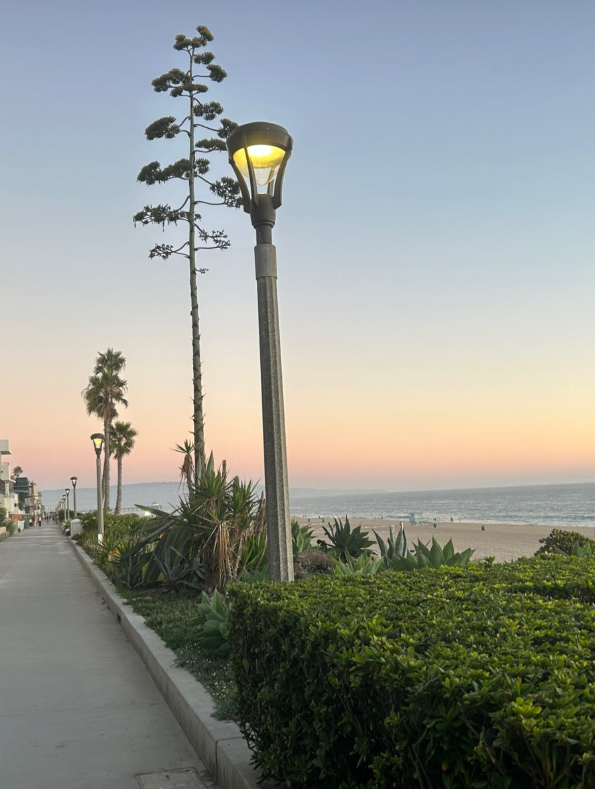
  
  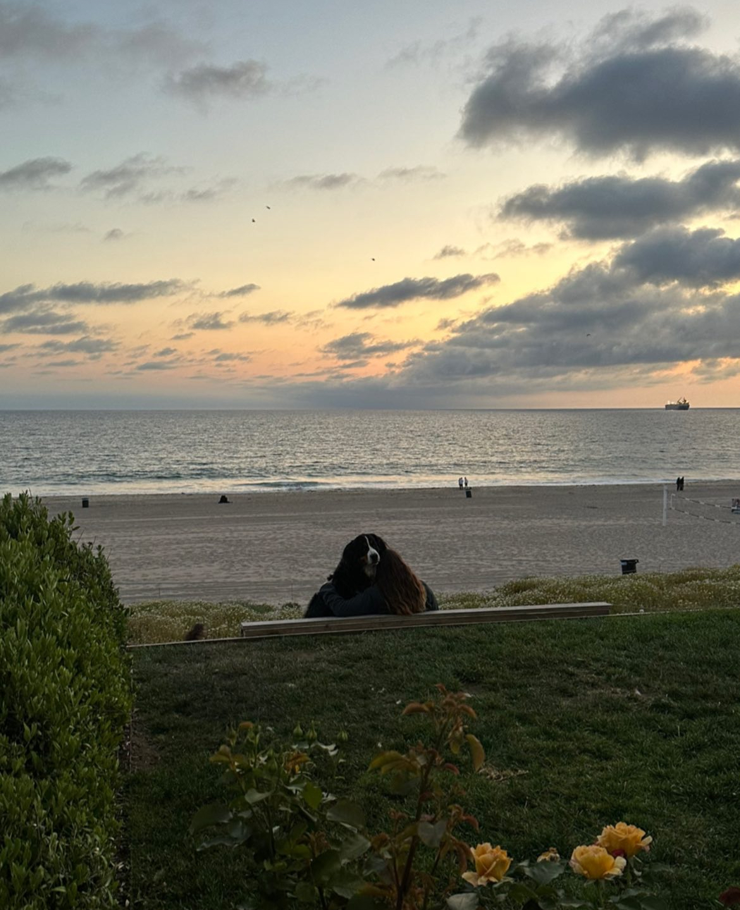
  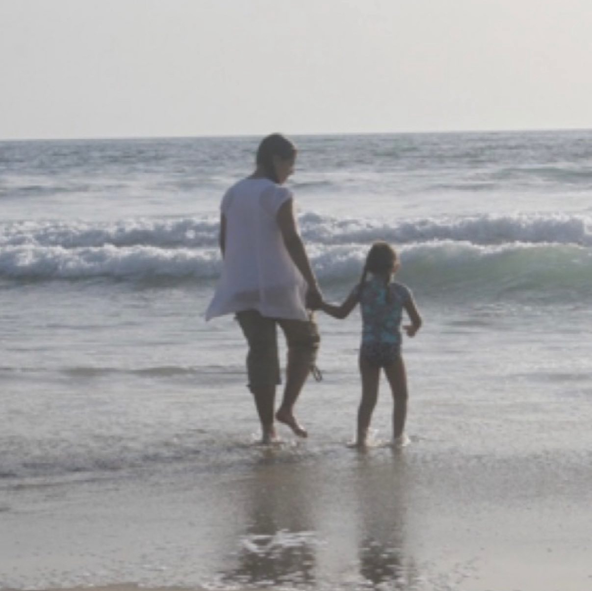
  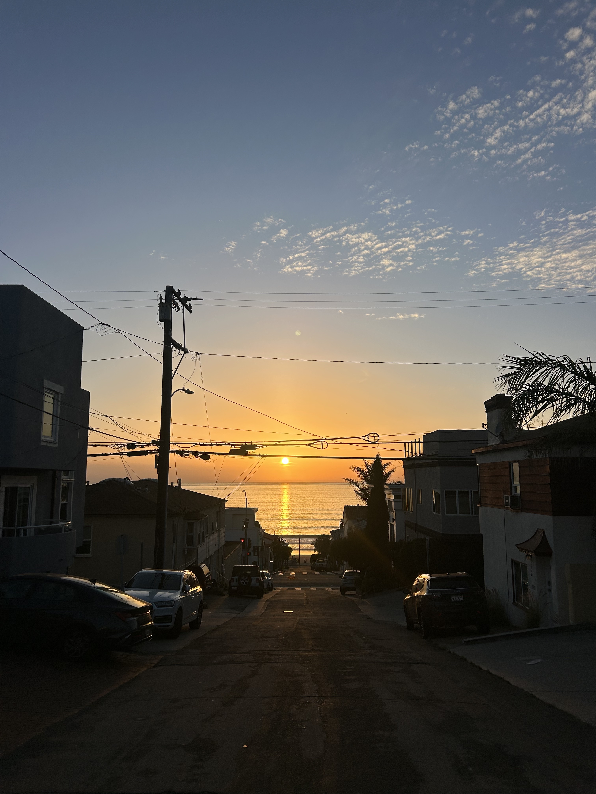
  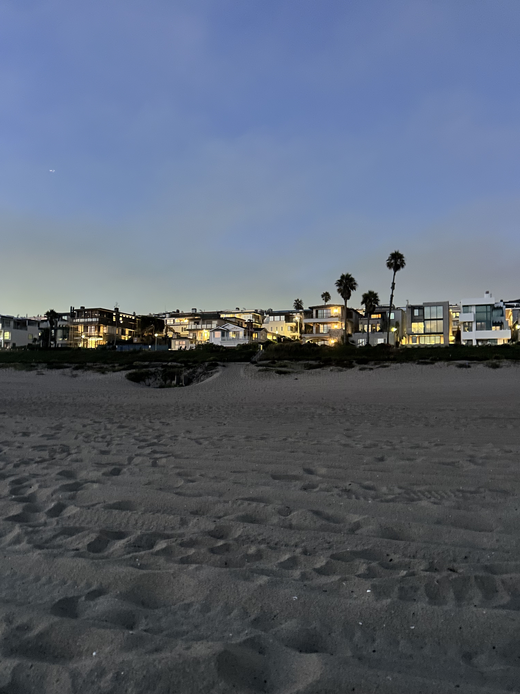
</div>

## My Family 
:::: {layout-nrow="1"}
::: figure
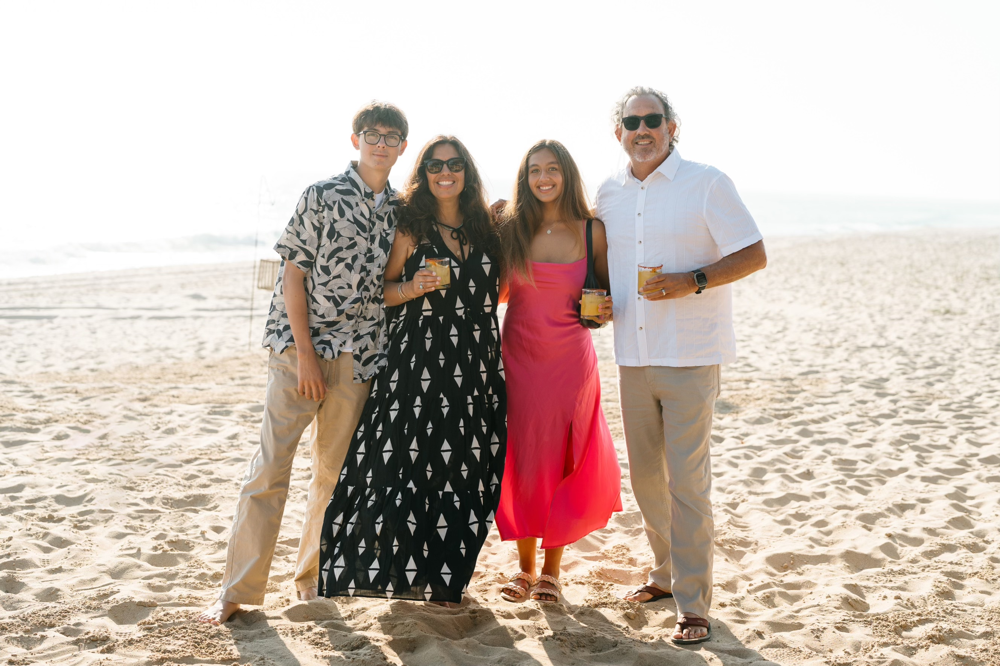{.regular-hover}
:::
::::
I grew up in a very loving, supportive family with my mom (Zoya), dad (John) and my little brother Marty (3 years younger). My family is super important to me and they are the reason I am who I am today. Without my mom, I would not know what hard work and dedication was. Without my dad, I would not know what empathy was, or be as caring for others as I am today. Without my brother, I would have been bored out of my mind during COVID, and would not have a soft and loving spot in my heart. One day, I hope to be as fun and hardworking as my parents are. Some of our favorite family activities include playing cards, surfing, road tripping, and binge watching SNL skits while dying laughing. 

### The Family Password: Pepper

:::: {layout-nrow="1"}
::: figure
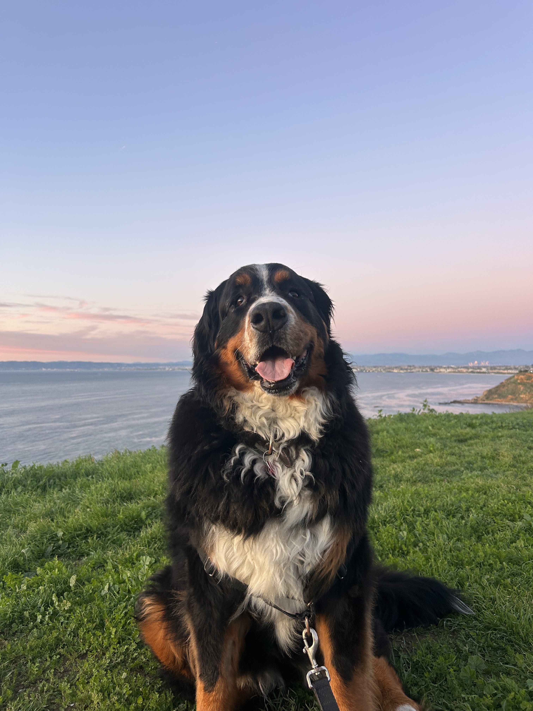{.regular-hover}
:::
::::
Pepper is the love of my life and the best dog in the entire world. She was the topic of my college personal statement essay, which got me in to so many schools, and is our cherished COVID baby. She is also known as: Boom, Booming, Mamas, Peps, Pepsi, and more. 

## My Favorite Hobbies/Passtimes 

### Surfing 

I learned to surf when I was 6 years old, and was taught by my dad. Since then, I have shared countless of waves with my dad and my friends. 

:::: {layout-nrow="1"}
::: figure
{group="Surfing"}
:::

::: figure
{group="Surfing"}
:::

::: figure
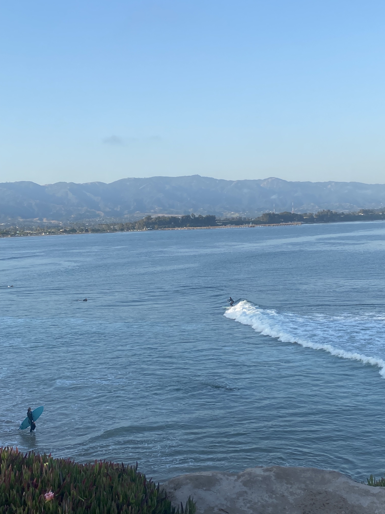{group="Surfing"}
:::
::::


### Cooking and Baking 

From baking during COVID to cooking in my small Isla Vista house, I have always loved working in the kitchen. Most of my recipes are taught from my dad and my nana. 

::: {layout="[[1,1,1], [1,1]]"}
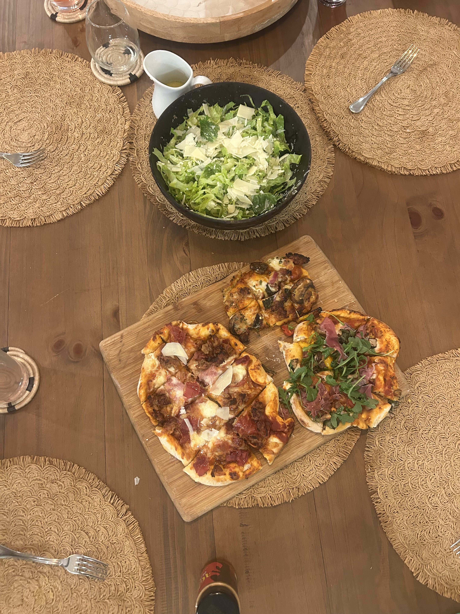{group="Cooking and Baking"}


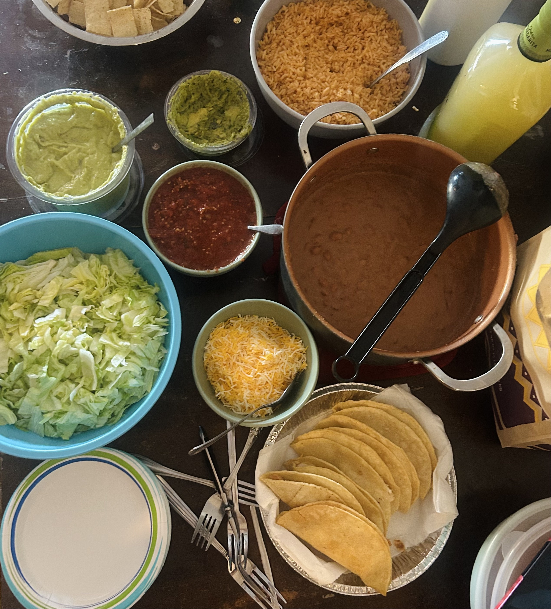{group="Cooking and Baking"}


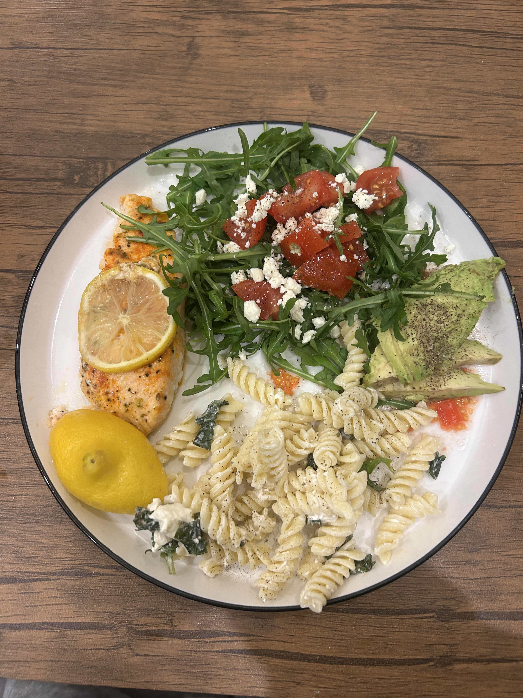{group="Cooking and Baking"}

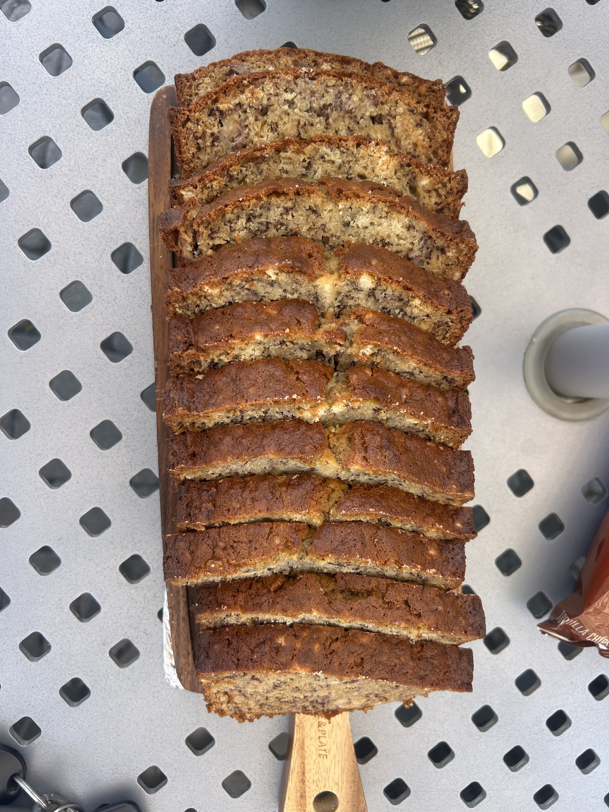{group="Cooking and Baking"}

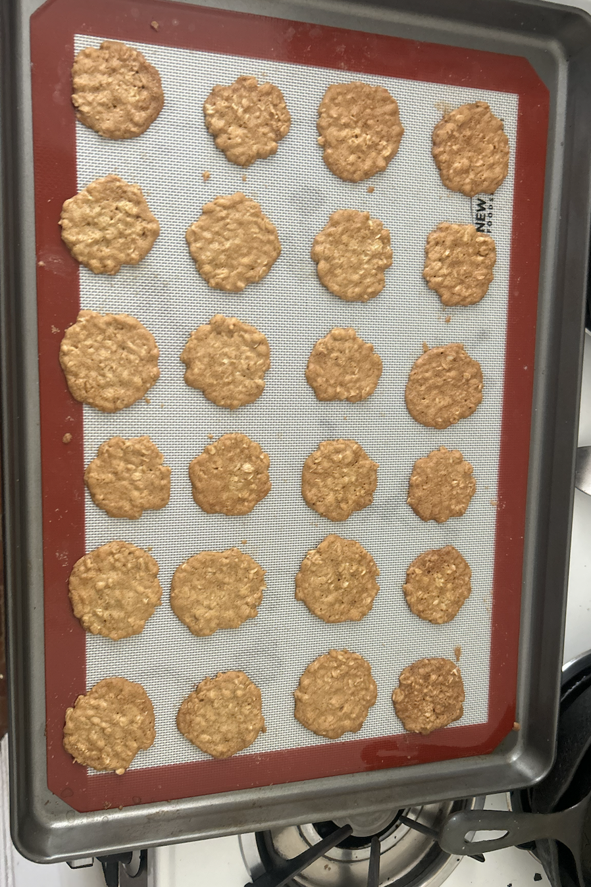{group="Cooking and Baking"}
:::

### Yoga 
As a break from school work, I enjoy taking yoga classes to reconnect with myself and exercise! Here is a map of some of the Yoga Studios I have been to in Santa Barbara. 

```{r}
#| echo: false
#| message: false
#| warning: false

# loading in packages
library(sf)  # spatial data handling             
library(leaflet) # interactive map creation       
library(htmltools) # HTML rendering for labels and popups   
library(janitor) # cleaning column names
library(tidyverse) # data manipulation and piping
library(readr)  # reading CSV files
library(dplyr)


# reading in data 
yoga <- read_csv("yoga.csv")

# loading in icon 
studio_icon <- makeIcon(
  iconUrl = here::here("star.png"),
  iconWidth = 30, iconHeight = 30)
```

```{r}
#| echo: false
#| message: false
#| warning: false
#| code-fold: true 

# making map of studios 

site_map <- leaflet() |> 
  
  # add base map tiles (use `addTiles()` for Google maps tiles, OR `addProviderTiles()` for 3rd party base maps: https://leaflet-extras.github.io/leaflet-providers/preview/) ----
  addProviderTiles(providers$Esri.WorldImagery, group = "ESRI World Imagery") |>  
  addProviderTiles(providers$Esri.OceanBasemap, group = "ESRI Oceans") |> 
  
  # add mini map ----
  addMiniMap(toggleDisplay = TRUE, minimized = TRUE) |> 
  
  # set view over Goleta + SB ----
  setView(lng = -119.80, lat = 34.40, zoom = 12) |> 
  
  # add markers ----
  addMarkers(data = yoga, group = "name",
             icon = studio_icon,
             lng = ~long, lat = ~lat,
             popup = ~paste0(name, "<br>",
    "Coordinates: ", lat, ", ", long
  )) |> 
  
   # add layers control (toggle base map tiles & markers based on group IDs) ----
  addLayersControl(
    baseGroups = c("ESRI World Imagery", "ESRI Oceans"),
    overlayGroups = c("name"))

  
#view map 
site_map
```

## Education + Aspirations 
While I currently am getting my degree in Environmental Studies, my focus is in Marine Biology and Terrestrial ecology. Some of my career interests are field work and getting involved in marine or terrestrial conservation and restoration work. I am very passionate about sustainability and protecting our natural resources and species, so the general direction of my future career will be in that field. 

Some upcoming exciting news is that I will be participating in the **Bren Fellowship Program** this upcoming summer assisting on the “Promoting Wildfire Resilience in Santa Barbara County” project.  I was also selected to be published in the 2026 Edition of *Starting Lines*, the text book for the UCSB Writing Program. 

I look forward to continuing to build my network and broaden my skill set to narrow down what it is that I want to do for the rest of my life!


