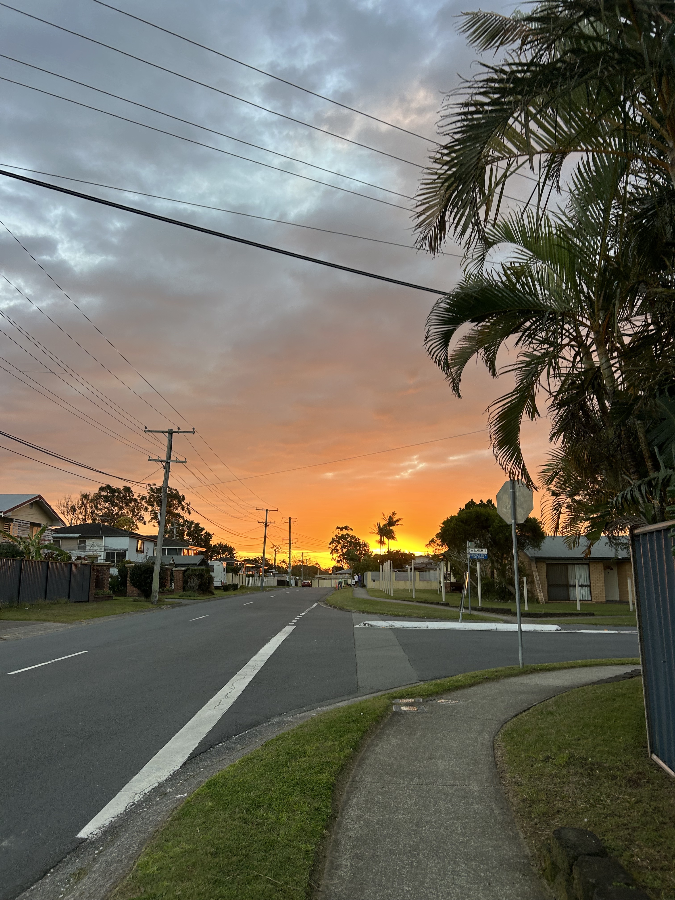

```{r setup, include=FALSE}
library(leaflet)
```

```{r}
#| echo: false
# Create the leaflet map with an embedded image in the popup
leaflet() %>%
  addTiles() %>%
  addMarkers(
    lng = -27.595, 
    lat = 153.123, 
    popup = "<b>Home Base: Rochedale South</b><br>"
  )
```

# On my Own 
## Homebase: Brisbane, Australia 
Specifically: Rochedale South 

#### University of Quensland, St. Lucia Campus 

## Lamington National Park 

## North Stradbroke Island (Minjerribah)

## Canarvon Gorge 

## Heron Island

## Byron Bay 

## Gold Coast 

# With my Mom !

## Syndey 

## Melbourne 

## Witsundays (Airle Beach)

## Noosa 


##