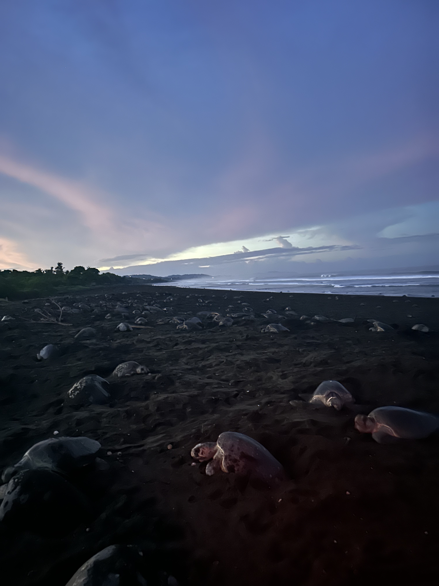
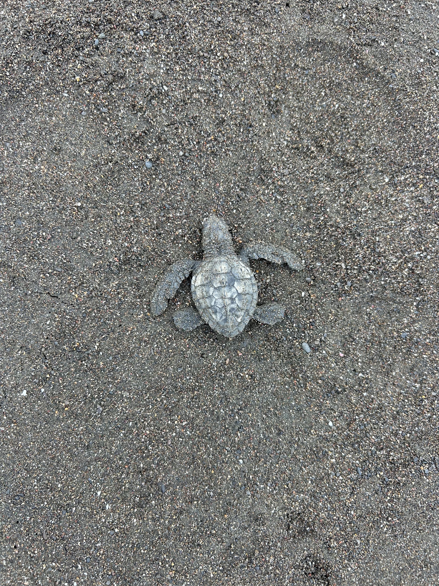

## What I was Up To Here

The summer in between my Freshman Sophomore year of college (in 2024), I signed up to go on the 10 day sea turtle field course in Ostional, Costa Rica. This was one of the most spontaneous decisions I had made thus far in college as I have never traveled by myself before and knew nobody in my program. However, this experience has turned out to be one of the best trips of my life.

::::: columns
::: {.column width="60%"}
{width="95%"}
:::

::: {.column width="40%"}
Through the BIOMA program, I gained valuable experience in field work, data collection and learned a lot about local conservation management strategies around the Olive Ridley Sea Turtle species. We partook in "citizen science", where we went on nightly patrols in shifts (either 8pm-12am or 12am-4am) to monitor sea turtle activity and nesting. During these patrols, we had to wear dark clothing and only use red light headlamps to avoid disturbing and scaring the turtles while they nest. We collected data in small groups of 4-5 with a head instructor, measuring the sea turtle carapace size, the flipped length, the clutch size, counted how many eggs the turtle lay, and how long it took her to do so. Someone was also tasked with recording data and the location of each turtle we recorded data for. During the data collection portion, we were not allowed to go in front of the turtles and had to stay out of her eyesight to avoid making her abandon her nest.
:::
:::::

::::: columns
::: {.column width="40%"}
During my time in Ostional, I got to witness an arribada (spanish word for "the arrival"), which is a mass nesting event that takes place across 3-5 days. This is a phenomena that only happens with Ridley sea turtles (both Kemp's and Olives), and it is when thousands of sea turtles simultaneously come to the nesting beach to nest roughly once a month during nesting season. The cause of this event is unknown, however it was truly an amazing site to see. Data collection looked a little different, as we ran transects along beach markers in order to estimate how many turtles came up to the beach to nest during the arribada. 
:::

::: {.column width="60%"}
{width="95%"}
:::
:::::

Through group discussions throughout the program, we got to learn about various management strategies and sea turtle conservation as a whole, specifically during the mass nesting events that are unique to Ostional. One of which was where locals harvest eggs during the first few days of the event to consume and sell as the likelihood of them being dug up by another turtle the following day are high, and chances of survival are low. It is also proposed that this enhances the hatching success rate of other nests that are laid as it reduces  disease transfer through the sand. 

## Some Fun Images from my Trip

I will forever cherish this experience and it is what has encouraged me to get involved in species conservation and take the ENVS 193ST: Sea Turtle Conservation and Management course at UCSB. It deepened my love for turtles and love for being abroad, and I cannot wait to potentially pursue a career like this in the future in nature conservation. 

  
  
  
  
  
  

