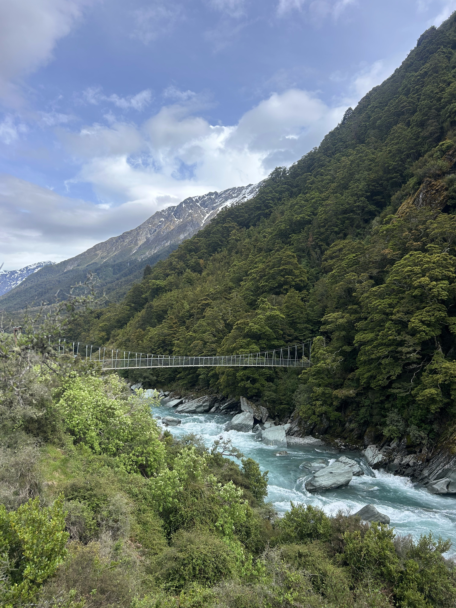
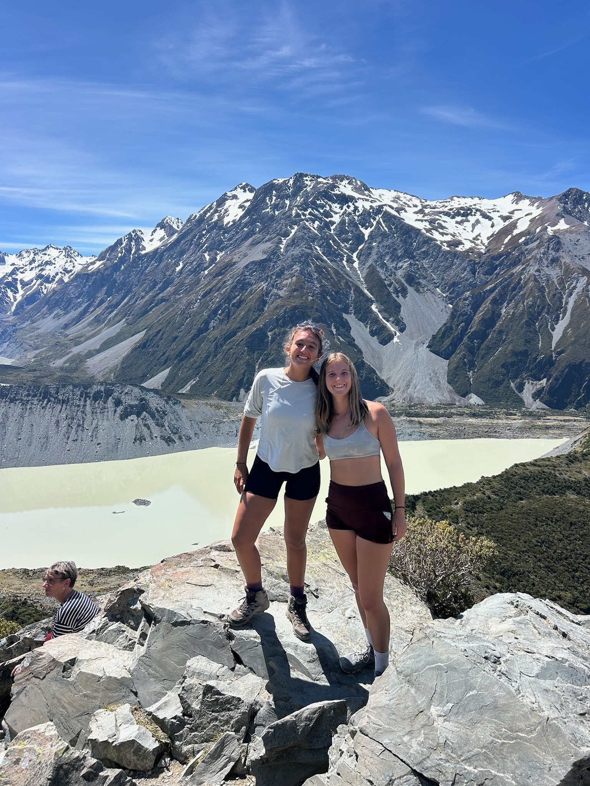
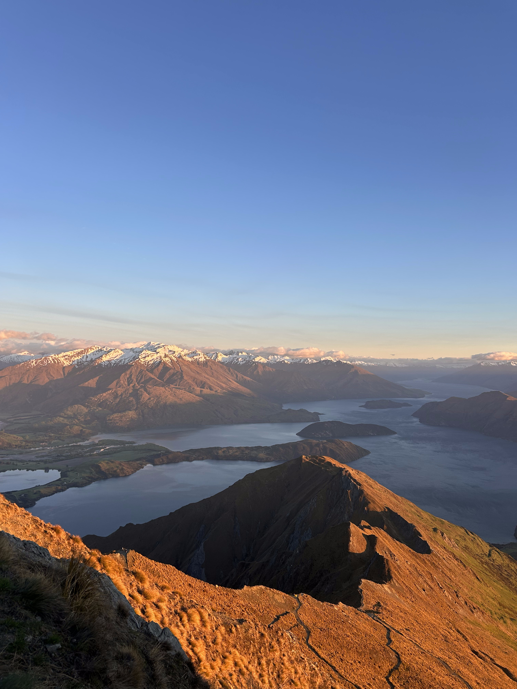

After my study abroad experience in Australia, my hometown friend and I traveled the South Island of New Zealand together in a tiny red Suzuki Swift we named "Little Red Dumpling", after a delicious restaurant we both went to in Australia. On this map is my guide of everywhere we went and everywhere we saw! Truly an adventure of a lifetime. 

# Personal Guide

```{=html}
<iframe src="https://www.google.com/maps/d/u/0/embed?mid=15cJzatC_Mhhh3ar3Fhv7r9TZM1N36xA&ehbc=2E312F" width="640" height="480"></iframe>
```

## Some Quick Photo Highlights

::: {layout="[1,1,1]"}





:::
