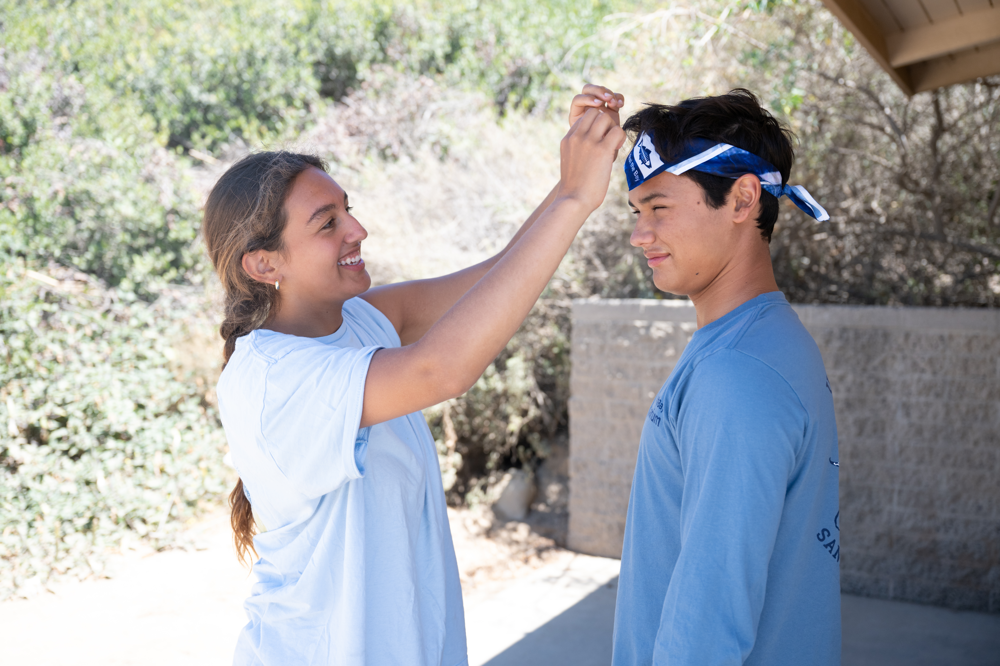
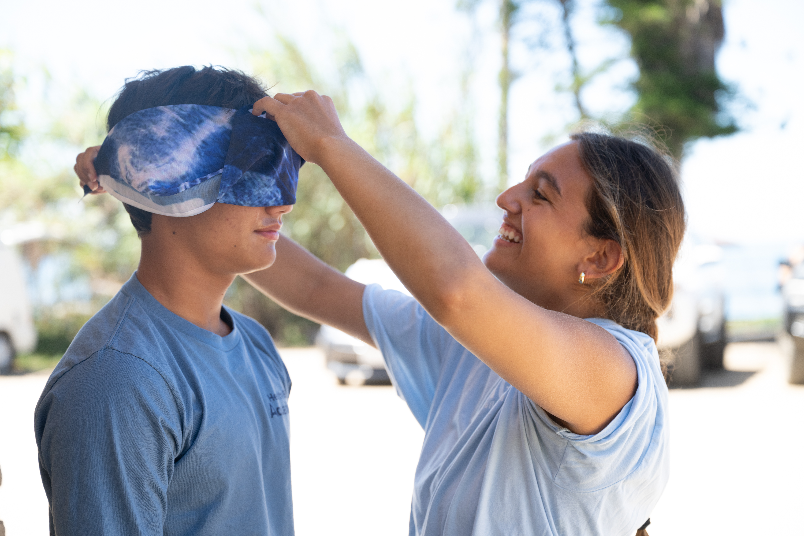

*Over the summer in 2025, I lead the production of a photo shoot to reboot the non-profit Heal the Bay merchandise page on their website. This including finding a professional photographer, models, staging the photo shoots, designing the visuals and communication with Heal the Bay.*

## Photos in Action 

:::: {layout-nrow="1"}
::: figure
{.regular-hover}
:::

::: figure
{.regular-hover}
:::

::: figure
{.regular-hover}
:::
::::

## Designed Product Layout 
:::: {layout-nrow="1"}
::: figure
{.regular-hover}
:::
::::

For the final product, visit the [Heal the Bay Website](https://shop.healthebay.org/collections/apparel)
